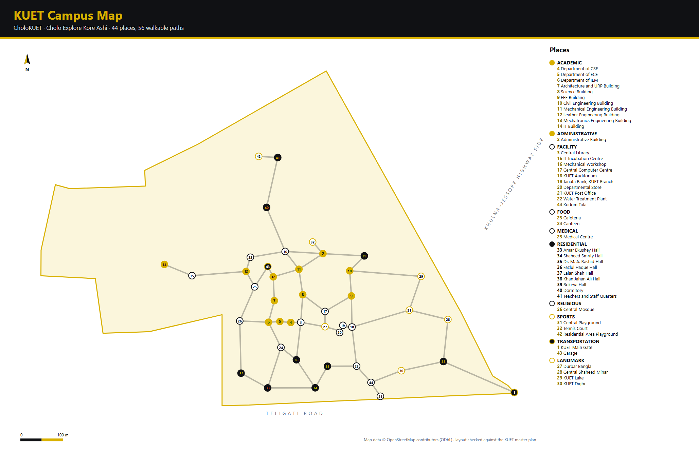
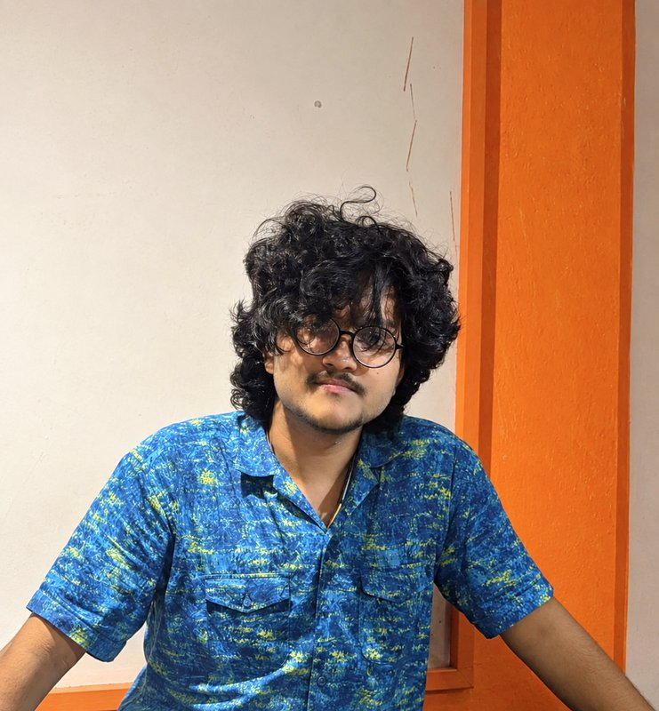

<p align="center">
  
</p>

<p align="center">
  <b>An offline campus navigator for KUET, built on hand-written data structures.</b><br>
  <sub>Data Structures and Algorithms Laboratory · Department of CSE, KUET</sub>
</p>

<p align="center">
  
  
  
  
</p>

---

## About

_Cholo Explore Kore Ashi_ means "come on, let's go explore". CholoKUET is a terminal app that helps new students and visitors find their way around the KUET campus. Tell it where you are and where you want to go, and it tells you which roads to take, where to turn, what you pass on the way, and how long the walk takes.

It covers **44 places** joined by **56 walkways** on **15 roads**, using real coordinates from OpenStreetMap and the KUET master plan.

<p align="center">
  
  <br><sub>The numbers are the place IDs you can type in the app. Map data © OpenStreetMap contributors.</sub>
</p>

## Features

| #     | Menu               | What it does                                                              |
| ----- | ------------------ | ------------------------------------------------------------------------- |
| 1     | Take me somewhere  | Turn-by-turn walking directions between any two places                    |
| 2     | What's near me     | The 10 closest places, with distance, direction and walking time          |
| 3     | Explore the campus | Walk the whole campus with DFS and check that every place is reachable    |
| 4     | Search             | Find a place by name, category or number                                  |
| 5     | Browse by category | The campus as a tree: KUET → category → place                             |
| 6     | Sort places        | A–Z, Z–A, by category or by distance, with comparison and swap counts     |
| 7     | Where am I?        | Set your location by place name or coordinates                            |
| 8     | Trip history       | Every place you have been; **Back** takes you to the last one             |
| 9     | Recent searches    | The last 10 places you searched for                                       |
| 10    | Favorites          | Starred places, saved for each user                                       |
| 12–15 | Admin              | Add, edit and delete places and walkways; view users and the activity log |

A sample trip:

```text
  Central Library  →  KUET Main Gate
  707 m walk · about 10 min · 9 places · 3 roads

   ●  Start at Central Library
   1  Head south on Library Lane  ·  89 m, about 2 min
   2  Turn left, heading east on Hall Road  ·  258 m, about 4 min
   │  past Shaheed Smrity Hall, Dr. M. A. Rashid Hall and Cafeteria
   3  Turn left, heading east on KUET Road  ·  360 m, about 5 min
   │  past KUET Dighi and Khan Jahan Ali Hall
   ●  Arrive at KUET Main Gate
```

## How it works

Each feature is built on a data structure or algorithm from the course.

| Structure / algorithm               | Where it is used                                                |
| ----------------------------------- | --------------------------------------------------------------- |
| **Stack** (our own, array based)    | DFS, the Back button, turning the BFS route the right way round |
| **Queue** (our own, circular array) | BFS for every route                                             |
| **Array**                           | The list of all places                                          |
| **Linked list**                     | Recent searches, favorites, BFS routes                          |
| **Tree**                            | Browse by category                                              |
| **Graph** (adjacency list)          | Walkways between places                                         |
| **BFS / DFS**                       | Finding routes, exploring, connectivity checks                  |
| **Linear / binary search**          | Search and every "which place?" prompt                          |
| **Bubble / selection sort**         | Sort places, What's near me                                     |

The stack and queue are written by hand in [`dsa/`](dsa/). The program never uses `std::stack`, `std::queue` or `std::sort`, and `make check-manual` confirms it. See [docs/dsa-mapping.md](docs/dsa-mapping.md) for the full mapping and complexity table.

## Getting started

### Requirements

- **g++** with C++17 support. On Windows, install it through [MSYS2](https://www.msys2.org/) with `pacman -S mingw-w64-ucrt-x86_64-gcc`, then add `C:\msys64\ucrt64\bin` to your `PATH`.
- **make** or **CMake** (optional).

### Build and run

From the project folder:

```bash
make run        # build bin/CholoKUET and start it
make test       # build and run all unit tests
make clean      # remove build output
```

Without make, one command builds everything, because `main.cpp` pulls in the other source files:

```bash
g++ -std=c++17 main.cpp -o CholoKUET
./CholoKUET
```

Or with CMake:

```bash
cmake -S . -B build
cmake --build build
ctest --test-dir build
```

Run the program from the project folder (or a folder below it) so it can find `data/`.

### Default accounts

| Username   | Password     | Role    |
| ---------- | ------------ | ------- |
| `student1` | `student123` | student |
| `admin`    | `admin123`   | admin   |

These are created automatically if `data/users.txt` is missing.

## Project structure

```text
CholoKUET/
├── main.cpp        entry point
├── dsa/            our Stack and Queue
├── include/        headers
├── src/            the application (graph, tree, search, sort, menus, ...)
├── data/           places, walkways, categories, users, favorites
├── tests/          8 unit-test programs
├── docs/           DSA mapping, map notes, viva questions
├── presentation/   project report (DOCX, PDF) and slides
├── assets/         logo, campus map, team photos
├── tools/          render-map.js, which redraws the campus map
└── third_party/    termcolor (terminal colours)
```

## Documentation

- [Project website](docs/index.html): open it in a browser for a live, animated demo
- [Project report (PDF)](presentation/CholoKUET%20Report.pdf)
- [DSA mapping](docs/dsa-mapping.md)
- [How the campus map was made](docs/campus-map.md)
- [Viva questions and answers](docs/viva-questions.md)
- [Code walkthrough](explain.txt)

## Team

<table>
  <tr>
    <td align="center" width="50%">
      <br>
      <b>Ettisaf Rup</b><br>
      Roll: 2407109
    </td>
    <td align="center" width="50%">
      <br>
      <b>Afia Anjum Broti</b><br>
      Roll: 2407096
    </td>
  </tr>
</table>

**Course teachers:** Subah Nawar and Lamisa Bintee Mizan Deya, Lecturers, Department of CSE, KUET.

## Credits and license

- Map data © [OpenStreetMap](https://www.openstreetmap.org/copyright) contributors (ODbL)
- Road layout from the _Proposed Revised Master Plan of KUET Khulna Campus_
- Terminal colours by [termcolor](https://github.com/ikalnytskyi/termcolor) (BSD 3-Clause)

The login is a simple local one for this project and is **not** real security.

Released under the [MIT License](LICENSE).
